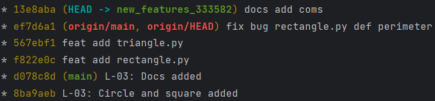

# Geometrical Shapes
This project can calculate area and perimetr of the simplest shapes

## Circle

### Formulas
- Area: S = πr²
- Perimetr: P = 2πr

### Functions
- Area(r) 
- Perimetr(r) 

### Example
- Area(5) = 25π
- Perimetr(2) = 4π

## Rectangle

### Formulas
- Area: S = ab
- Perimetr: P = 2a + 2b = 2(a + b)

### Functions
- Area(a, b)
- Perimetr(a, b)

### Example
- Area (1, 2) = 2
- Perimetr (2, 3) = 10

## Square

### Formulas
- Area: S = a²
- Perimetr: P = 4a

### Functions
- Area(a)
- Perimetr(a)

### Example
- Area(3) = 9
- Perimetr(1) = 4

## Triangle

### Formulas 
- Area: S = (a * h) / 2
- Perimetr: P = a + b + c

### Functions
- Area(a, h) 
- Perimetr(a, b, c)

### Example
- Area(2, 5) = 5
- Perimetr(1, 2, 3) = 6

# Unit Testcases in tests.py file
- Tests from examples

# Commit History

